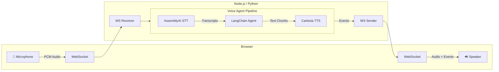
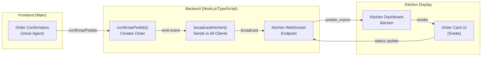

# Voice Sandwich Demo 🥪

A real-time, voice-to-voice AI pipeline demo featuring a sandwich shop order assistant. Built with LangChain/LangGraph agents, AssemblyAI for speech-to-text, and Cartesia for text-to-speech.

## Architecture

The pipeline processes audio through three transform stages using async generators with a producer-consumer pattern:



### Pipeline Stages

Each stage is an async generator that transforms a stream of events:

1. **STT Stage** (`sttStream`): Streams audio to AssemblyAI, yields transcription events (`stt_chunk`, `stt_output`)
2. **Agent Stage** (`agentStream`): Passes upstream events through, invokes LangChain agent on final transcripts, yields agent responses (`agent_chunk`, `tool_call`, `tool_result`, `agent_end`)
3. **TTS Stage** (`ttsStream`): Passes upstream events through, sends agent text to Cartesia, yields audio events (`tts_chunk`)

## Prerequisites

- **Node.js** (v18+) or **Python** (3.11+)
- **pnpm** or **uv** (Python package manager)

### API Keys

| Service | Environment Variable | Purpose |
|---------|---------------------|---------|
| AssemblyAI | `ASSEMBLYAI_API_KEY` | Speech-to-Text |
| Cartesia | `CARTESIA_API_KEY` | Text-to-Speech |
| Anthropic | `ANTHROPIC_API_KEY` | LangChain Agent (Claude) |

## Quick Start

### Using Make (Recommended)

```bash
# Install all dependencies
make bootstrap

# Run TypeScript implementation (with hot reload)
make dev-ts

# Or run Python implementation (with hot reload)
make dev-py
```

The app will be available at `http://localhost:8000`

### Manual Setup

#### TypeScript

```bash
cd components/typescript
pnpm install
cd ../web
pnpm install && pnpm build
cd ../typescript
pnpm run server
```

#### Python

```bash
cd components/python
uv sync --dev
cd ../web
pnpm install && pnpm build
cd ../python
uv run src/main.py
```

## Project Structure

```
components/
├── web/                 # Svelte frontend (shared by both backends)
│   └── src/
├── typescript/          # Node.js backend
│   └── src/
│       ├── index.ts     # Main server & pipeline
│       ├── assemblyai/  # AssemblyAI STT client
│       ├── cartesia/    # Cartesia TTS client
│       └── elevenlabs/  # Alternate TTS client
└── python/              # Python backend
    └── src/
        ├── main.py             # Main server & pipeline
        ├── assemblyai_stt.py
        ├── cartesia_tts.py
        ├── elevenlabs_tts.py   # Alternate TTS client
        └── events.py           # Event type definitions
```

## Event Types

The pipeline communicates via a unified event stream:

| Event | Direction | Description |
|-------|-----------|-------------|
| `stt_chunk` | STT → Client | Partial transcription (real-time feedback) |
| `stt_output` | STT → Agent | Final transcription |
| `agent_chunk` | Agent → TTS | Text chunk from agent response |
| `tool_call` | Agent → Client | Tool invocation |
| `tool_result` | Agent → Client | Tool execution result |
| `agent_end` | Agent → TTS | Signals end of agent turn |
| `tts_chunk` | TTS → Client | Audio chunk for playback |

## 🍕 Kitchen Display System (KDS)

### Overview

The Kitchen Display System provides a real-time dashboard for kitchen staff to manage incoming orders. Orders are managed via WebSocket communication and automatically broadcast to all connected kitchen clients.

### Features

- **Real-time Updates**: Orders appear instantly without page refresh
- **Order Management**: Track order status (nuevo → en preparación → listo)
- **Live Broadcasting**: All connected kitchen displays update simultaneously
- **Persistent Order Queue**: All existing orders are sent to new clients upon connection

### Architecture



### Components

#### Backend Order Management

Located in [components/typescript/src/index.ts](components/typescript/src/index.ts):

- **`Pedido` Type**: Order data structure with id, items, time, and status
- **`confirmarPedido(items)`**: Creates and broadcasts a new order
- **`broadcastKitchen(event)`**: Sends events to all connected kitchen clients
- **Kitchen WebSocket Endpoint** (`/ws/kitchen`): Handles client connections and status updates

#### Frontend Kitchen Dashboard

Located in [components/web/src/routes/kitchen/+page.svelte](components/web/src/routes/kitchen/+page.svelte):

- Connects to `/ws/kitchen` endpoint
- Displays all orders in a grid layout
- Allows status transitions with buttons
- Auto-updates when orders change

### Usage

#### 1. Start the Application

```bash
make dev-ts  # or make dev-py
```

This runs:
- Backend server on `http://localhost:8001`
- Frontend on `http://localhost:5173`

#### 2. Open Two Browser Windows

- **Window 1**: Main app at `http://localhost:5173/`
- **Window 2**: Kitchen display at `http://localhost:5173/kitchen`

#### 3. Place Orders

In Window 1, use the voice assistant to order items. For example:
- "I'd like a turkey sandwich with lettuce and mayo"
- "Can I get a ham and swiss on rye?"

When you say "confirm order" or similar, the order is created and immediately appears in Window 2.

#### 4. Manage Orders in Kitchen

In Window 2, you can:
- Click **"En preparación"** to mark an order as being prepared
- Click **"Listo"** to mark an order as ready
- Changes are broadcast in real-time to all connected displays

### Minimum Test Cases

1. **Caso 1 - Nuevo pedido en tiempo real**
Start with `/kitchen` open, confirm one order in the main experience, and verify it appears instantly without refreshing.

2. **Caso 2 - Varios pedidos**
Confirm multiple orders from the main experience and verify all are listed correctly in `/kitchen`.

3. **Caso 3 - Cambio de estado**
From `/kitchen`, update an order from `nuevo` to `en preparación` and then `listo`; verify all connected kitchen clients receive the update immediately.

### WebSocket Protocol

#### Client → Server

```json
{
  "type": "actualizar_estado",
  "id": "uuid-of-order",
  "estado": "en preparación" | "listo"
}
```

#### Server → Client

```json
{
  "type": "todos_pedidos",
  "pedidos": [ ... ]
}
```

```json
{
  "type": "pedido_nuevo",
  "pedido": { id, items, time, estado }
}
```

```json
{
  "type": "pedido_actualizado",
  "pedido": { id, items, time, estado }
}
```

### Integration Notes

To integrate order confirmation with your frontend voice flow:

1. The `confirmarPedido(items: string[])` function is called when an order is confirmed
2. Extract item names from your agent's `add_to_order` tool calls
3. Call `confirmarPedido()` with the accumulated items
4. The order automatically appears in all connected kitchen displays

Example integration:

```typescript
// In your agent response handling
if (toolCall.name === "confirm_order") {
  const items = extractItemsFromOrder(/* ... */);
  confirmarPedido(items);
}
```

## Entrega en Canvas

### Entregable requerido

Sube **un solo PDF** que incluya:

1. Link al video en Google Drive.
2. Link al repositorio publico en GitHub.

### Regla critica

Si no hay video, la tarea vale **0 puntos**.

### Checklist del video (maximo 3 minutos)

1. Nombres, carnets y repositorio.
2. Ejecucion del proyecto.
3. Creacion de un nuevo pedido.
4. Actualizacion automatica en `/kitchen` sin refresh.
5. Al menos un cambio de estado (`nuevo` -> `en preparacion` -> `listo`).
6. Explicacion breve de como se implemento el tiempo real (WebSocket/eventos).

### Checklist de demostracion minima

1. Caso 1: Se genera un pedido y aparece automaticamente en `/kitchen`.
2. Caso 2: Se generan varios pedidos y se visualizan correctamente.
3. Caso 3: Se actualiza el estado de un pedido y el cambio se refleja en vivo.